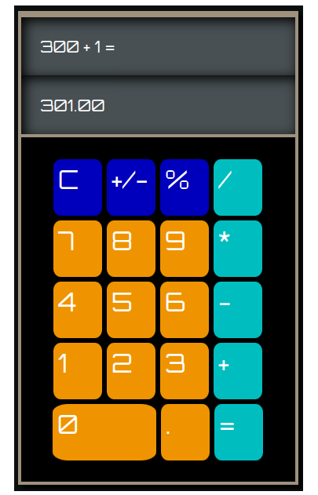

#Calculator 

Welcome to the Calculator a fun and interactive calculator experience that brings back the  joy of pressing buttons, now with added colour and sound effects! 
https://opuslearning.github.io/Calculator/
How to Use
1. The Grid
Button Layout: The calculator grid features a familiar layout, with number keys, basic operations, and some handy functions like C (Clear), +/- (Toggle Sign), and % (Percentage). Each button is colour-coded for easy recognition:
Orange for numbers
Blue for utility functions (C, +/-, %)
Cyan for operators (+, -, *, /, =)
2. Interactivity
Sound Feedback: Every time you press a button, you’ll hear a satisfying click, thanks to the keySound audio file. This adds a tactile feel to your digital calculations.
Button Press Animation: Each button changes colour briefly when clicked, giving you immediate visual feedback. No more wondering if you hit the wrong button!
3. Performing Calculations
Simple Operations: Click the number buttons to enter a value, select an operator (+, -, *, /), and then enter another number. Press = to see the result.
Advanced Functions:
Toggle Sign (+/-): Flip the sign of the current number.
Percentage (%): Convert the current number into a percentage.
Decimal (.): Add a decimal point to the number.
Clear (C): Reset everything to start over.
4. Error Handling
Division by Zero: If you attempt to divide by zero, the calculator will cheekily respond with "I'm sorry Dave..."—a nod to the classic film 2001: A Space Odyssey.
Features
Custom Grid Creation
The calculator grid is dynamically generated using the createGrid() function, which builds the layout based on the keys defined in the keyArray. This means the calculator's interface is constructed entirely with JavaScript, making it easy to modify or extend.
Dynamic Display
The calculator features two display areas:
Main Display: Shows the current input or result.
Calculation Display: Keeps track of the ongoing calculation, displaying the formula as you build it.
Colour-Coded Buttons

To include a screenshot of the calculator in action, place calculator_grid.png in the same directory as this README and use the following Markdown to display it:

markdown
Copy code

This line of code will embed the screenshot right in your README, giving a visual preview of the calculator’s interface.

Getting Started
Setup
Simply open the index.html file in your favourite browser, and you’re ready to start calculating!

Requirements
Ensure you have the click.mp3 sound file in the same directory as your JavaScript file to experience the full interactive effects.

